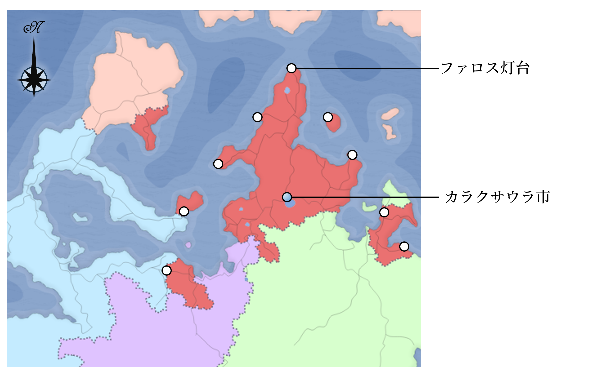

# 謎解きのヒント&解答

『星陰』には複数の推理・パズル・クイズ要素が散りばめられています。どのような道筋で答えにたどり着けるのか、作成者なりの模範解答を提示します。

## フーガ殺害

フーガを殺したのはシンフォニーです。答えにたどり着くには 2 つの道筋が想定されます。

### 1. キャロルが切り札を提示した場合

**キャロルの切り札**情報として

- 凶器は銃
- 死亡推定時刻は 00:00~01:30

ということがわかります。この時間帯に外出していたセレナーデ・ララバイ・キャロルは除外され、容疑者として**シンフォニーとカプリッチオだけ**が残ります。**拳銃を持っている**のはシンフォニーのため、犯人が確定します。

### 2. キャロルが切り札を提示しない場合

01:55 にフーガ（実際には**セレナーデの変装**）が目撃されていますが、その後 3 階へ上るのを見られている**ララバイが最も怪しい**立場になります。自室にいる時間が長い**キャロルが次点で怪しい**でしょう。

- カード「変装道具」「脱出用通路」
- セレナーデはララバイから 3 階への行き方を聞いていた
- セレナーデがなぜかララバイの部屋から出てきた

という情報を統合すると、セレナーデにも犯行が可能になります。もしセレナーデの証言を信じるなら、フーガの死体はセレナーデが発見(02:22)するまでに少なくとも１時間は経っており、01:22 以前、つまりセレナーデ・ララバイ・キャロルが外出している時間に殺されていることになります。ここから先はキャロルが切り札を提示した場合と同じ状況になります。

結局、セレナーデを信じるなら容疑者は「シンフォニー／カプリッチオ」、信じないなら「セレナーデ／ララバイ／キャロル」になります。凶器を所有しえたキャラクターは「シンフォニー／セレナーデ／ララバイ」です。ここから先は、真実は何か、以上に、どういった真実が自分にとって有利か、という勝負になるかと思います。

その他、**シンフォニーの切り札**で「フーガの死体」や「ナイフ」を調べることで推理に役立ちますが、真犯人のシンフォニーにとってメリットは限定的でしょう。

### シンフォニーがスパイであること

シンフォニーを疑うきっかけとして、**シンフォニーが当局のスパイである**、という点があります。このことは

- ララバイのハンドアウト: そのまま書いてある。
- 情報漏洩の時期: アリアが情報漏洩をするために夏音を抜ける、というのは不自然である。同時期にはシンフォニーが加入している。
- カード「灰皿」「指紋鑑定キット」

## アリア殺害

アリアを殺害したのはララバイです。謎を解くカギは以下の通りです。

- シンフォニーのハンドアウト情報
  - 容疑者はカプリッチオ／ララバイ／キャロル
  - カプリッチオは事件当日、近くで目撃証言がある
  - ララバイは事件当日、東飛び地で任務をこなしていた
  - 凶器は刃渡り 15cm の鋭器
- カード「変装道具」「ナイフ」「星見」
- 「アリアのスマートフォン」の着信履歴に残る γ 国からの電話（カプリッチオから）

その他、シンフォニーの切り札で上記カードを調べることで、ララバイの関与が判明します。

## ハスター招来・解放の陰謀

ハスター招来・解放の陰謀はキャロルとカプリッチオしか知りません。中でもカプリッチオが「ロンドの研究ノート」で情報公開しないと陰謀の存在自体が表になりません。

### キャロル側（陰謀の実現）

キャロルがハスターを招来・解放する条件は

- （金庫の鍵を入手）
- 「石板〈ハスターの招来・解放〉」を入手
- ファロス灯台が爆破されない
- エンディングで誰にも邪魔されず、「呪文〈ハスターの招来・解放〉」を唱える

です。また、サポートのため

- 黄色の印

を使って、仲間を増やすことができます。

**金庫の鍵の所有者がカプリッチオ**であることは

- 「ロンドの研究ノート」: 鍵を託された旨が記載されている。

の公開で確定しますが、カプリッチオとフーガの関係性や「カプリッチオが決意を固めた目つきをしていた」（ララバイのハンドアウト）など、から推測することは可能です。

### カプリッチオ側（陰謀の阻止）

カプリッチオ側が陰謀を阻止するためには「石板〈ハスターの招来・解放〉」を、キャロル側よりも早く回収する必要があります。石板が入手された後も

- 「起爆スイッチ」: ファロス灯台の爆破
- 「フーガのメモ」: クトゥルフの星の落とし子との接触

といった対処法があります。黄色の印に対しては

- 「ロンドの研究ノート」: 黄色の印に警戒する旨を記載
- 「腕時計」: エルダーサインが刻まれており、黄色の印に対する対抗手段
- 「変装道具」: アリアがカプリッチオにプレゼントしようと考えていた指輪が入っている。腕時計同様、エルダーサインが刻まれている。（指輪をはめる、という主旨の発言がないと効果はない）
- 「アリアのスマートフォン」: エルダーサインについて記載

といった対抗手段があります。

**キャロルが黄色の印の親子団**である、という情報は

- 「検視結果」:キャロルの両親は 12 年前に死亡しており、殺人事件が関与している蓋然性が高い
- 「大規模宗教抗争か」: 12 年前にヨウテラベ市のカルト集団（ハイドラ教団）とは別のカルト集団（黄色の印の親子団）が滅んでいる。

### 双方が使用可能なギミック

- 「サイレンサー付き拳銃」「ナイフ」: 敵の殺害、石板やメモの破壊
- 「拘束」: 敵の拘束
- 「命令」: 石板やメモの回収

は行動順が速い人に有利なギミックとなります。

## モノリス

超高層ビルとファロス灯台にハスターを呼ぶためのモノリス（=一枚岩を使用した建築物）であることに気がつくと、政府の関与を疑い、ファロス灯台を爆破する根拠になります。

### 超高層ビルとファロス灯台と巨岩

超高層ビルやファロス灯台に巨大な岩が使われている、という情報は、

- ララバイのハンドアウト（全ての超高層ビルとファロス灯台について）
- シンフォニー・セレナーデのハンドアウト（地元の超高層ビルについて）
- カード「ファロス灯台の歴史」「超高層ビル完成」

に記載があります。また、ファロス灯台に仕掛けた爆弾が巨岩を破壊することはララバイのハンドアウトで保証されています。

### モノリスの分布

ゲームボードには、都市名がわかるマップが置かれていますが、どの都市が経済推進都市であるかの知識は、プレイヤーによって差があります。

|    情報源    |                          都市名                           |
| :----------: | :-------------------------------------------------------: |
| シンフォニー |                 ヨウテラベ市 クリオ市                 |
|  セレナーデ  |         カリオベ市 ヨウテラベ市 マリネ市          |
|   ララバイ   | ヨウテラベ市 エラド市 テラブシコ市 マリボネ市 |

特に西半分の経済推進都市についてはララバイが詳しいです。上記に上がっていませんが、ホリミナイ市も経済推進都市です。

また、ほとんどの χ 国内の都市名が、[オーケアニス](https://ja.wikipedia.org/wiki/%E3%82%AA%E3%83%BC%E3%82%B1%E3%82%A2%E3%83%8B%E3%82%B9)をもじっているのに対して、経済推進都市だけは[ムーサイ（ミュース）](https://ja.wikipedia.org/wiki/%E3%83%A0%E3%83%BC%E3%82%B5)の[ヘシオドスによる九姉妹](https://ja.wikipedia.org/wiki/%E3%83%A0%E3%83%BC%E3%82%B5#ヘシオドスによる九姉妹)から命名されています。

白い丸がモノリスの位置を示しています。

## アリアのスマートフォン

セレナーデとララバイが追い求める「アリアのスマートフォン」は、プレイヤーの目標さえ変えてしまえる重要アイテムです。

ロック画面の「**夢の途上。私の作品番号を知っている人に渡してください**」は謎解きとなっています。

「途上+私の作品番号」=「ト上アリアの作品番号」=「**G 線上のアリアの作品番号**」である「**bwv1068**」がパスコードとなっています。G 線上のアリアの作品番号なんて知らない、というツッコミもあるかと思いますが、
以下のヒントがあります。

- セレナーデ: 「アリアのメモ」に「bwv1068」と記載されている。
- ララバイ: ハンドアウトに「私の作品番号～」の記述がある
- シンフォニー: 「アリアの本名を伝える」ことで「G 線上のアリア」の解説が手に入る。

また、BGM に G 線上のアリアを使うことを推奨しています。

## フーガのスマートフォン

キャロルが所有する「フーガのスマートフォン」は、ハスターの招来・解放を阻止するための手段が書かれている重要アイテムです。ロック画面には英数字 5-10 桁パスワードがかかっています。パスワードは「Cancer」です。大文字小文字の区別はありません。

ヒントとしては

- キャロルの HO に「誕生日がいつだったか」を意識している記述
- カプリッチオの HO にフーガの誕生日（7/22）が記載されている
- ララバイの HO にフーガのスマホが「C から始まる 6 桁」と記載されている。

です。

フーガの誕生日はかに座ですが、キャロルの「昨夜の記録」を見るとかに座の英語が「Cancer」と書いてあります。そういえば「<ruby>癌<rp>（</rp><rt>がん</rt><rp>）</rp></ruby>」も英語で Cancer ですね。
