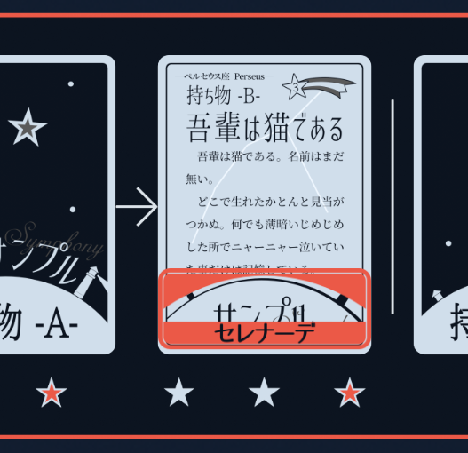

<head><meta name="robots" content="noindex">
</head>

# よくある質問

### Q. これは誤字ですか？
A. 誤字です。[作者](https://twitter.com/KTakahiro1729)までご連絡ください。

### Q. ココフォリアが壊れました。
A. とりあえず[作者](https://twitter.com/KTakahiro1729)に連絡しつつ、GM用説明書の[カード解説](Cards.md)から、画像をダウンロードしてプレイヤーに送りつけてください。

### Q. 過去にGMしたとき、ここに書いてあることと別の処理をしたことがあります。
A. 大丈夫です。こまかいルールのミスなどはゲームバランスにたいして影響しませんし、本作品は改変自由です。PLに聞かれたら「改変しました！」とお答えください。ですが、HOの渡し間違えだけお気を付けください。私は2回目のテストプレイの時に追加HOを渡し間違えた上に終わるまで気が付きませんでした。

## カード調査&全体公開編

### Q. 自分が全体公開できるカードは？
A. 「自分が所持しているカード」です。これは具体的に言うと、

- 未調査の自分の証拠カード
- 自分の切り札カード
- 一番右の星に調査ポイントを置いているカード
- 細長のマーカーを置いているカード

です。

### Q. カードの全体公開はいつできますか？
A. いつでも全体公開可能です。なんならオープニング中に開けてくれてもいいですし、エンディングでもターン消費なく全体公開できます。

### Q. 全体公開じゃないカードは誰が見られますか？
A. 下の星の上に調査ポイントを置いている人だけです。同じ調査組で調査している人は無関係です。

### Q. 自分のカードを見られますか？
A. できません。が、うっかり見ても大したことがない場合が多いのであまり気にしないでください。

### Q. カードをこっそり見せられますか？
A. 見せられません。非公開のカードを見ることができるのは、下に星が置いてある人だけです。こっそり見せるには、一時的に譲渡してください。

### Q. 横長のマーカーはいつ使いますか？
A. 全体公開したときに使います。全体公開されていないカードは一番右の調査ポイントの持ち主がカードの所有者です。

### Q. 全体公開で戻ってくる調査ポイントは誰の調査ポイントですか？
A. 調査ポイントで返ってくるポイントは「調査ポイントが乗っている人全員」に「1ptずつ」です。一番右の人とかランダムとかではないです。

### Q. 戻ってこない調査ポイントはどうしたらいいですか？
A. そこに置きっぱなしにしておいてください。投票権の購入などでいらなくなった調査ポイントはロゴのあたりに捨てといてください。

### Q. 未調査の自分の証拠カードの効果は使用できますか？
A. できます。

### Q. 未調査の自分の証拠カードは全体公開できますか？
A. できます。ただし、全体公開しても他の人が調査できることに変わりありません。その場合、所有権は調査完了した相手に渡ります。

### Q. 未調査の自分の証拠カードは譲渡できますか？
A. 全体公開すればできます。ただし、譲渡しても他の人が調査できることに変わりありません。その場合、所有権は調査完了した相手に渡ります。

### Q. 全体公開してある証拠カード（未調査）は調査できますか？
A. できます。「全体公開している/いない」と「調査されている/されていない」は無関係です。全体公開していていようが何しようが、調査状況には影響しません。注意点としては、「調査ポイントが返ってくるタイミングは全体公開のタイミング」です。要するに、すでに全体公開されているカードを調査した場合、そこに費やした調査ポイントは二度と返ってきません。

### Q. 全体公開している証拠カード（未調査）は飛ばして調査できますか？
A. できません。「全体公開している/いない」と「調査されている/されていない」は無関係です。全体公開していていようが何しようが、調査状況には影響しません。注意点としては、「調査ポイントが返ってくるタイミングは全体公開のタイミング」です。要するに、すでに全体公開されているカードを調査した場合、そこに費やした調査ポイントは二度と返ってきません。

### Q. 未調査の自分の証拠カードを全体公開した後、他プレイヤーへ譲渡した場合、マーカーはどう表示しますか？
A. 苦肉の策ですが、以下の画像のようにしてください。

### Q. カードを途中まで調査しておくことはできますか？
A. できます。自分でカードを所有しておくことは難しくなりますが、情報を得ることはできるでしょう。

### Q. 途中まで調査されたカードは全体公開できますか？
A. できます。ただし、全体公開しても他の人が調査できることに変わりありませんし、調査の進捗はリセットされません。また、所有権は調査を完了した相手に渡ります。ややこしさのわりに意義に乏しいのでお勧めしません。

マーカーの置き方ですが、調査ポイントはその場に置きっぱなしにし、返却される分調査ポイントのコマを複製してください。

### Q. 途中まで調査されたカードを全体公開した後、他プレイヤーへ譲渡した場合、マーカーはどう表示しますか？
A. マーカーの置き方ですが、調査ポイントはその場に置きっぱなしにして、返却される調査ポイント分のコマを複製してください。そのうえで、譲渡の処理は[未調査の自分のカードを全体公開して譲渡する](../FAQ/index.html#opened_before_researched)と同様にしてください。

## 調査その他編

### Q. ○○を「GMに伝えろ」っていつ、どうやって伝えるんですか？
A. いつでも、口頭でも壁打ちでもお伝えください。伝える際は「何のカードに関する回答か」を添えてください。

### Q. 一回の調査で使える調査ポイントは1人3ptずつですか？
A. 2人「合わせて」3ptです。どう分担するかは話し合って決めてください。話し合いに決着がつかないなら抜け駆けをするか、何も調べずに帰ってください。

### Q. 誰が指名したか、は調査に影響しますか？　例えば、調査ポイントの使い方の決定権を持つとか。
A. しません。指名権はあくまでも「誰と誰が一緒に調査するか」を決める権利です。自分が指名したターンの調査であっても、どこを調査するか選べたり、何ポイントずつ使うかを決められたりはしません。

## 密談・全体会議編

### Q. 指名する時間も5分に含まれますか？
A. 含まれます。あまりに指名に時間がかかる場合、GMから急かしたり、「ではOO分までに決まらない場合、自動的に全体会議とします」と宣言したりします。

### Q. 犯人COは可能ですか？
A. 可能です。

### Q. カードの中身を読み上げて伝えるのは大丈夫ですか？
A. 大丈夫です。

### Q. ハンドアウトの中身をそのまま読むのは大丈夫ですか？
A. メタ推理が働くので一般論として推奨されません。とはいえ、「禁止です！」といわれて出来るものでもありません。読み上げるふりをしてあえてハメに行く行為は禁止しませんので、メタ推理を働かせるほうもやめておきましょう。

##　投票・エンディング編
### Q. 推理発表の時間制限はありますか？
A. ご自由に話して下さい。10分とか20分とか話していたらGMから止めに入ります。

### Q. 自投票可能ですか？
A. リーダー・犯人ともに自投票可能です。

### Q. 投票権を買うと、どちらの投票権が買えるのですか？
A. みなさんには、もともと犯人投票用の票、リーダー投票用の票がそれぞれ1票ずつあります。それが2票ずつ、3票ずつになります。

### Q. 投票権を買わないと投票はできないのですか？
A. みなさんには、もともと犯人投票用の票、リーダー投票用の票がそれぞれ1票ずつあります。

### Q. 複数票持っている場合、投票先を分けられますか？
A. 分けられません。計算ツールの作成がややこしくなるからです。

### Q. リーダー権限はターンを消費しますか？
A. します。

### Q. エンディングでできることは1コだけですか？
A. 物語に終わりが付くまで何順もします。

### Q. これは一ターンで可能な行為ですか？
A. GM裁量です。裁量を下すときは自信満々に行きましょう。

### Q. PL同士で対立する処理があって、どっちを優先するべきか分かりません。
A. ダイス勝負させましょう。

### Q. 今までで一番面白かったエンディングはなんですか？
A. セレナーデが暴れまわってキャロル含めて全員で取り押さえた回ですかね？

### Q. 腕時計の発動条件って？
A. 所有していることが条件です。セレナーデの場合、全体公開していなくても発動します。要するにパッシブアイテム。

## 追加HO編
### Q. 黄色の印とエルダーサインはどっちが強いですか？
A. エルダーサインを所持している状態（セレナーデが腕時計を破壊されず、譲渡もしていない状態。全体公開である必要はない）であれば、所有していても黄色の印HOは渡されません。一方で、すでに黄色の印を持った後でエルダーサインを渡されても、目標上書き状態は解除されません。

### Q. 黄色の印HOで目標が変わり、アリアのスマートフォンでも目標が変わりました。どっちが優先ですか？
A. 黄色の印HOが優先です。

### Q. 金庫解錠の処理がよくわかりません。
A. ややこしい場合は、鍵のカードを消す、という処理でもOKです。最新版（2022/05/02）であれば、金庫の下にも鍵の下にも石板が置いてあります。

## シンフォニーから聞かれがち
### Q. エンディングまで拳銃が調査されなければ、使用可能ですか？
A. 使用可能です。使う際は全体公開してからお使いください。

### Q. エンディング以前に拳銃が全体公開された場合でも、拳銃は使えますか？
A. 使うタイミングまでに全体公開されていれば、いつ全体公開されていても問題ありません。要するに「全体公開されてないよくわからんカードに撃ち殺された」っていう状況を避けるためです。

### Q. ロンドって本当に死んだんですか？
A. 本当に死にました。アリアの死を自殺と報道した理由にしろ、この件にしろ、シンフォニーには嘘が流されています。シンフォニーには後日「逮捕後、自害した」とでも伝えるつもりでしょう。

## セレナーデから聞かれがち

### Q. 事前クイズのセレナーデQ5、2人じゃないんですか？
A. 質問の内容は、変装中そして「変装解除後」のことを質問しています。変装中はキャロルとカプリッチオに、変装解除後はシンフォニーとカプリッチオに見られているので3人です。

### Q. エンディングまでナイフが調査されなければ、使用可能ですか？
A. 使用可能です。使う際は全体公開してからお使いください。

### Q. エンディング以前にナイフが全体公開された場合でも、ナイフは使えますか？
A. 使うタイミングまでに全体公開されていれば、いつ全体公開されていても問題ありません。要するに「全体公開されてないよくわからんカードに撃ち殺された」っていう状況を避けるためです。

### Q. 結局、トーラスって何だったんですか？
A. タバコの銘柄でした。シンフォニーの昨夜の記録をご確認ください。アリア殺害犯を突き止めるには、シンフォニーと連携する必要があります。「トーラスはタバコ」と伝えることで、「シンフォニーと協力してください」という追加HOが配られます。

## ララバイから聞かれがち
### Q. 東飛び地について聞くという目標が云々
A. 「南西飛び地について聞く」という目標のまま変わりありません。しかし、作者のポンが原因で、どこかに誤字が生存している可能性があります。

### Q. 目星ってどのカードに使えるんですか？
A. 切り札含めて、どのカードにも使えます。ロゴの上にある「リーダー」「犯人」というのにも使えますよ。

### Q. 目星って誰かが調査したカードにも使えますか？
A. すでに調査済みのカードにも使えます。

### Q. 今からアリアの家に行けますか？　行ってエルダーサインを回収できますか？
A. 遠いので無理です。

### Q. 起爆スイッチを今（調査フェーズ中）押したいです。
A. ダメです。ダメったらダメなの！！

……エンディングで押してください。

## キャロルから聞かれがち
### Q. 事前クイズのキャロルQ4.はどこに書いてありますか？
A. キャロル視点の登場人物、の一番上の行を見てください。

### Q. 今（調査フェーズ中）、呪文唱えちゃダメですか？
A. アルデバランが空高く昇る時（エンディング）を待ちましょう。

### Q. 外出中にアルデバラン祭をした、って書いてあるんですが、カラクサウラに戻るの難しくないですか？
A. 隠れ家近くでアルデバラン祭もどきをやったと思ってください。本番は11月30日ですし。

## カプリッチオから聞かれがち

### Q. なぜフーガ殺害犯拘束の目標が0点なのでしょうか？
A. 複数の理由があります。

1. 全プレイヤーが「フーガ殺害犯を拘束する」を0点にしているのは、陰謀論にまつわる個人的な皮肉です。これがどういう意味かは個人の解釈にゆだねます。作品を作ったときからのこだわりで、他の2つの理由は後付けです。
2. カプリッチオがフーガ殺しの線を追うと、ハスター招来・解放に有利になってしまいます。
3. カプリッチオは「仕事」と「人間」を並べたときに、仕事を優先する人物と解釈しています。アリアと連絡を取るなと言われた時も同様でしたね。決して冷淡、感情がないという意味ではありません。ただ、かなしいくらいに、使命を優先してしまうのです。フーガに仕事を託されたとき、フーガの復讐よりもその使命の達成を優先してしまうのもこの心理でした。黄色の印のHOでは、この性格について悔悟とともに綴っています。

### Q. 白すぎて疑われました。
A. 雑なメタ推理するPLが悪い。

## 作品のツッコミどころ
### Q. 情報量多くない？
A. おっしゃる通りです。

### Q. 追加情報多くない？
A. おっしゃる通りです。

### Q. システムややこしくない？
A. おっしゃる通りです。

……発想自体は簡単だったのですが、細かいルールを詰めたらややこしくなりました。ボードゲームの側面もありますので、ぜひ楽しんでほしいと思ってます。

## 物語のツッコミどころ編
### Q. フーガの見る目なさすぎません？
A. フーガには見る目がありません。

### Q. 夏音のメンバーは報道を一切見ていないってマジ？
A. マジ。カプリッチオは経済系の官僚なのにどうやってたんでしょうね？

### Q. モノリスって巨岩って意味じゃなくないですか？
A. モノリスは一枚岩、って意味なのでおっしゃる通りです。作者はモノリスをモニュメントと勘違いしたまま物語を完成させ、後日指摘されたので「経済推進都市には岩があるから大丈夫！」と主張しています。

### Q. アリアはなんでヘラ市へ直接会いに行かなかったんですか？
A. もし若干やばいことをしている組織に属していて、家族同然に思っていて、その組織から急に音信が途絶えたらどう思います？　人によると思いますが、逮捕されて、自分に連絡が取れない、と思うんじゃないでしょうか？　ノコノコと探しに行って、自分まで逮捕されてしまう、そんな可能性を考えてアリアはヨウテラベから出ない決断をしました。
