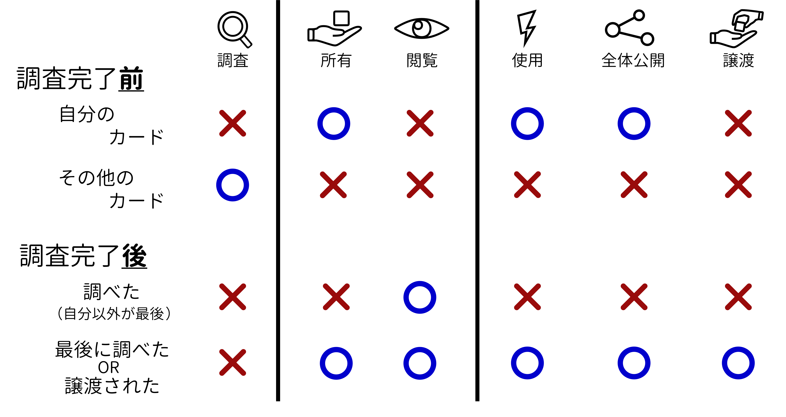

# 君ならわかる！『星陰』のルール説明】
共通ハンドアウトと同様の物を記載しています。ここに記されていない内容は[ルールの補足](RulesAdditiona.md)を参照して下さい。

## 概要
　このゲームはGM(ゲームマスター)+5人プレイ用のマーダーミステリーです。ハンドアウトとカードの情報をもとに、それぞれのゴールを目指してください。

　「ハンドアウト」「調査ポイントとカード」「カードの種類」「調査組/居残り組」「ゲーム全体の流れ」の説明をします。
## ハンドアウト
　この共通ハンドアウトのほか、プレイヤーには「PC用ハンドアウト」が配られます。

　時間がない場合でも、最後についている「A4一枚でわかる時系列」には目を通しておいてください。読むときは後ろの方の知識・記憶を参照するといいでしょう。

　また、進行次第で追加ハンドアウトもあります。

## 調査ポイントとカード
> 判断材料がないのに、推論(すいろん)するのは禁物(きんもつ)だ。

> ――シャーロック・ホームズ（『ボヘミアの醜聞(しゅうぶん)』より）

## 調査ポイント
調査ポイントは🔍(むしめがね)のコマです。開始時点で6コずつあります。似たものとして、全体公開されたカードの今の持ち主を示すコマがあります。

- カード調査
- 投票権を購入（4コ/票）・売却（2コ/票）
- プレイヤー同士で受け渡し
- エンディングでのカード取得

ができます。また、調査ポイントが余っていると最終投票やエンディングで有利です。

カード調査以外は、いつでもできます。 
## カードの調査
調査できるカードの下には「☆(ほし)」マークが描かれています。☆の上に調査ポイントを乗せると、そのカードを「調査」できます。

カードの中には、2コ以上の調査ポイントが必要なカードもあります。ほかの人と協力して調査ポイントを分担することもできますし、自分一人だけで全部調査することもできます。左の☆から埋めて、一番右の☆に調査ポイントが乗ったら、そのカードは調査完了です。
## カードを見る・カードを持つ
調査が完了すると、協力した全員にカードが見られるようになります。特に、一番右の☆に調査ポイントを乗せた人、つまり最後に調査した人は、「カードを持っている」状態になります。
カードを持っているプレイヤーは、次の3つができます。

- カードの効果を使用
- カードを全体公開（こっそり見せるは×）
- カードをほかの人に譲渡(じょうと)

## カードの効果を使用
カードの説明に効果が書かれているものがたまにあります。

例えば「拘束具(こうそくぐ)」というカードがあって、「このカードを使用すると、特定のキャラクターを1人、拘束することができる」みたいなことが書いてあります。

カードの効果を使うには、持っている人がGMに「〇〇を使います」と言ってください。みんなの前でいっても、こっそり言ってもかまいません。条件を満たしていたら、カードの効果が発動します。
## カードの全体公開
カードを持っている人が全体公開すると、カードに乗っている調査ポイントが1コだけ戻ってきます。2コ以上乗っている場合は、のこりを墓地に送ってください。
## カードの譲渡
真面目にやるとややこしいです。とりあえずGMと相手の前で「〇〇を譲渡したい」と言ってください。いい感じになると思います。全体公開されていないカードを譲り受けるときは調査ポイントが余っている必要がある、とだけ覚えておいてください。

できること、できないことをまとめると、こんな表になります。
 

重要なポイントは

- 自分のカードは「調査」はできないけど、「使用」と「全体公開」はできる
- 調査に協力すると、調査完了後に「閲覧」だけはできる
- 最後に調べた（一番右の☆に置いた）人は何でもできる

です。

## カードの種類
カードには、キャラごとに「証拠」「切り札」、場に「フーガの部屋」「新聞紙」の4種類があります。「切り札」以外は調査ができます。ほかのカードもあります。

### 自分のキャラクターのカード
「証拠」カード3枚と「切り札」カード1枚は、各キャラクターに配布されています。この4枚の中に、効果を持つものがあればその効果を使うことができますし、全体公開をすることもできます。

しかし、自分のカードを自分で調査すること、カードをほかのプレイヤーに譲渡すること、そしてカードを直接見ること、はできません。ほかの人が調査して全体公開したり、返してもらったりした場合は、これらの制限はありません。

繰り返しますが、自分の「証拠」「切り札」カードを直接見ることはできません。どんなカードなのか、各ハンドアウトの「自分のカード」を読んでください。カードと同じ内容が書いてあるかはさておき、ウソは書いてないはずです。
#### 証拠カード
「証拠」カードは、各キャラクターが3枚ずつ、「昨日の記録(☆1)」「持ち物 1(☆2)」「持ち物 2(☆3)」が1枚ずつもっています。

この3枚は左から順番に調べてください。例えばキャロルの「持ち物 1」を調べる前に、キャロルの「昨日の記録」の調査を完了してください。
#### 昨日の記録
一番はじめに調べる「昨日の記録」は☆1が必要なカードで、そのキャラクターが何をしていたか、がわかります。

「フーガは朝の6:45に死体で発見された」と書いてあれば、間違いなく死体が発見されましたし、「フーガは毎朝6:30にラジオをつけながら体操をしていた」と書いてあれば、日課のラジ〇(オー)体操は疑いようもありません。
#### 持ち物
次に調べられる「持ち物 1」や続く「持ち物 2」は名前の通り「キャラの持ち物」です。事件の証拠品だったり、エンディングに影響したりします。

「持ち物 1」が☆2、「持ち物 2」が☆3。必要な調査ポイントが多い分、「すごい」ものをご用意しています。
#### 切り札
「切り札」カードは、各プレイヤー1枚ずつ所有しています。切り札カードは、調査することができません。（☆が付いていません）

詳細を語ることはできませんが、

　- 強力な武器（比喩(ひゆ)）であり、重大な情報が書かれています。
　- 切り札が公開されなくても、必要な情報は手に入ります。

上記2点と次の言葉をよく覚えておいてください。

> 大いなる力には大いなる責任が伴う。

> ――ベン・パーカー（『スパイダーマン』より）
### フーガの部屋
「フーガの部屋」のカードが5枚ありますが、ゲームがはじまるときに1枚、全体公開されます。

　フーガの部屋のカードはすべて☆2です。
### 新聞紙
「新聞紙」のカードは5枚あります。すべて☆1ですが、政府は「メディアを通じて洗脳コードを脳内に送り込んでいる」ため、条件を満たすまで調査できません。
### その他
χ国及び周辺国家の地図があります。地図自体は調べられませんが、地図上の都市の説明は自由に見てください。

プレイの都合上、上記以外のカードが盤面(ばんめん)にあります。（新リーダーに渡される特殊カードなど）

くれぐれも見てしまわぬよう……。
## 調査組・居残り組
キャラクター達は1階のリビング・ダイニングで和気あいあいと（？）話しています。何か気になることがあれば、「調査組」と「居残(いのこ)り組」にわかれて調べ物に行きましょう。

> はーい！ じゃ今からグループ作ってー！

> ――担任教師（忌(い)まわしい記憶より）
### できること、できないこと
「調査組」（2人）と「居残り組」（3人）の違いは、カード調査ができるか、です。名前の通り、カード調査ができるのは「調査組」です。調査組を編成するたびに、2人あわせて調査ポイント3コ分のカード調査ができます。

そのほかは、できることに違いはありません。「グループごとの会話」「カードの全体公開・譲渡・効果の使用」は自由にしてください。（でも、GMは調査組にいることの方が多いかも）逆に、調査組になったからといって調査する義務があるわけではないので、密談代わりに使ってもいいでしょう。

調査フェーズを通して、各プレイヤーがPC番号順に持ち回りで調査組と居残り組を指名します。自分ともう一人を選んで調査組に行くこともできますし、自分以外の2人を調査組に選ぶこともできます。また、このとき全体会議を選ぶこともできます。つまり、ずっと全体会議をすることもできますし、全体会議が一度もない場合すらあり得ます。なお、全体会議中のカード調査はできません。

ちなみに会話中、ウソは問題ありません。自分の目標を達成するため、ウソをどんどんついていきましょう！
 
## ゲーム全体の流れ
3時間程度のゲームです。流れとしては、

1. オープニング
2. 調査・密談・全体会議（5分×5回×4フェーズ）
3. 最終投票
4. エンディング

　と進行します。（休憩もちゃんとあるよ！）

### オープニング
オープニング台本をみんなで読み合わせてください。 

### 調査・密談・全体会議
調査組（2名）と居残り組（3名）にわかれて、5分間の調査や話し合いをします。

PC番号順に、調査組と居残り組にどうわかれるか、を指名していきます。このとき、全体会議を選ぶこともできます。

各5分間、各プレイヤーが1回ずつ指名すると、合計25分間話し合うことになります。5分間の休憩を追加した30分を1フェーズとし、4フェーズ=2時間かかります。

### 推理発表・投票
最終投票では2つ投票をします。1つは「誰を犯人とするか」（犯人投票）、もう1つは「誰を新しいリーダーとするか」（リーダー投票）です。

話し合いはせずに、犯人投票の投票先と理由を順番に話します。その後、公開で投票を行います。投票先は変えてもかまいません。

犯人に選ばれると、エンディングでの行動が制限されます。リーダーに選ばれると、エンディングで大いに有利になります。詳細に関しては、推理発表前に公表されるカードに記載されています。

### エンディング
エンディングで行動順が決まっており、TRPGのようにカードを使った行動がとれます。行動順は、リーダー投票で選ばれたプレイヤーが最初、犯人投票で選ばれたプレイヤーが最後、残りのプレイヤーは余った調査ポイント数が多い人の行動順が早いです。

エンディングでは、カードを使ったり、受け渡したりできます。カードに書かれていない効果でも、GMの判断次第で使えます。